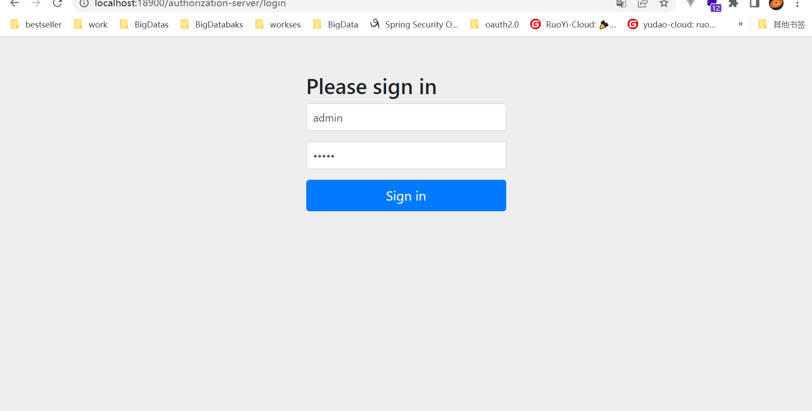

### 授权码模式

在浏览器上进行登陆

http://localhost:18900/authorization-server/oauth/authorize?client_id=client-id-rookie&client_secret=client-secret-rookie&response_type=code&scope=access

登陆成功并选择授权，返回如下

http://localhost:18900/authorization-server/access?code=6ILttk

获取token

http://localhost:18900/authorization-server/oauth/token?client_id=client-id-rookie&client_secret=client-secret-rookie&scope=access&code=6ILttk&grant_type=authorization_code

根据token调用请求进行资源访问

